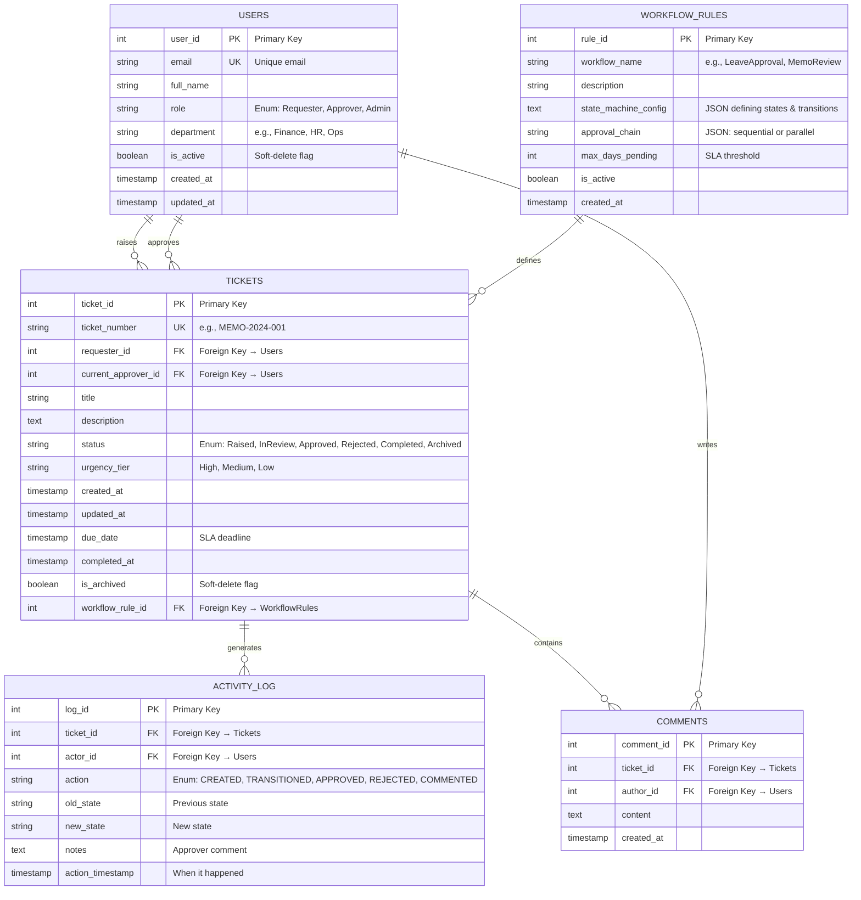

[&larr; Back to Home](../README.md)

## 5. Entity-Relationship Diagram (Mermaid)

 

**Why This Design?**

* **Immutability:** ACTIVITY_LOG is append-only; never updated or deleted

* **Auditability:** Every action tied to an actor and timestamp

* **Scalability:** Tickets and Activity Log can be sharded by ticket_id or created_at

* **Compliance:** Soft-delete flags (is_archived, is_active) preserve history

* **Extensibility:** WORKFLOW_RULES allows admins to define custom workflows without code changes

 

**Indexing Strategy:**

    CREATE INDEX idx_tickets_status ON tickets(status);
    CREATE INDEX idx_tickets_current_approver ON tickets(current_approver_id, status);
    CREATE INDEX idx_activity_log_ticket ON activity_log(ticket_id);
    CREATE INDEX idx_activity_log_timestamp ON activity_log(action_timestamp DESC);
    CREATE INDEX idx_tickets_created_at ON tickets(created_at DESC);